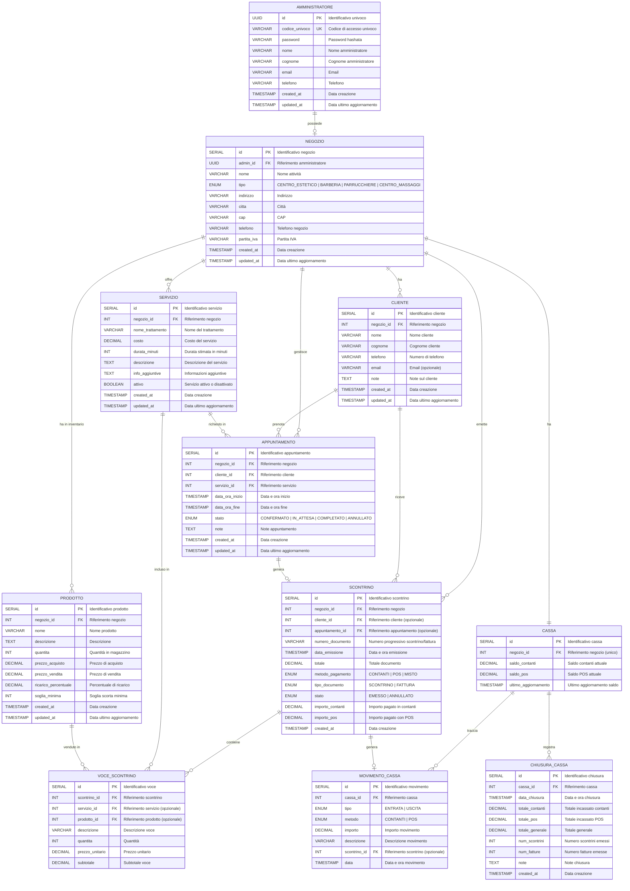

# 📊 Diagramma ER — ReserveME

## Panoramica Entità

Il database è progettato per gestire un sistema multi-tenant dove ogni **Amministratore** possiede un **Negozio** con i propri servizi, clienti, appuntamenti, inventario e gestione cassa.

---

## Diagramma Entità-Relazione

---

## Legenda Relazioni

| Relazione | Tipo | Descrizione |
|---|---|---|
| `AMMINISTRATORE → NEGOZIO` | 1:1 | Ogni admin possiede **un** negozio |
| `NEGOZIO → SERVIZIO` | 1:N | Un negozio offre **molti** servizi (menu) |
| `NEGOZIO → CLIENTE` | 1:N | Un negozio ha **molti** clienti |
| `NEGOZIO → APPUNTAMENTO` | 1:N | Un negozio gestisce **molti** appuntamenti |
| `NEGOZIO → PRODOTTO` | 1:N | Un negozio ha **molti** prodotti in inventario |
| `NEGOZIO → SCONTRINO` | 1:N | Un negozio emette **molti** scontrini/fatture |
| `NEGOZIO → CASSA` | 1:1 | Ogni negozio ha **una** cassa |
| `CLIENTE → APPUNTAMENTO` | 1:N | Un cliente può avere **molti** appuntamenti |
| `SERVIZIO → APPUNTAMENTO` | 1:N | Un servizio può essere richiesto in **molti** appuntamenti |
| `SCONTRINO → VOCE_SCONTRINO` | 1:N | Uno scontrino contiene **molte** voci |
| `CASSA → CHIUSURA_CASSA` | 1:N | Una cassa registra **molte** chiusure |
| `CASSA → MOVIMENTO_CASSA` | 1:N | Una cassa traccia **molti** movimenti |

---

## Note di Progettazione

1. **Multi-tenancy**: Ogni entità è legata al `negozio_id`, garantendo isolamento dei dati tra amministratori diversi
2. **Soft Delete**: Lo stato `ANNULLATO` negli scontrini e appuntamenti permette di mantenere lo storico senza eliminare dati
3. **Ricarico**: Il campo `ricarico_percentuale` nei prodotti viene calcolato come `((prezzo_vendita - prezzo_acquisto) / prezzo_acquisto) * 100`
4. **Pagamenti Misti**: Lo scontrino supporta pagamenti parte contanti e parte POS tramite i campi `importo_contanti` e `importo_pos`
5. **Tracciabilità**: I `MOVIMENTO_CASSA` tracciano ogni entrata/uscita per ricostruire lo storico della cassa in qualsiasi momento
