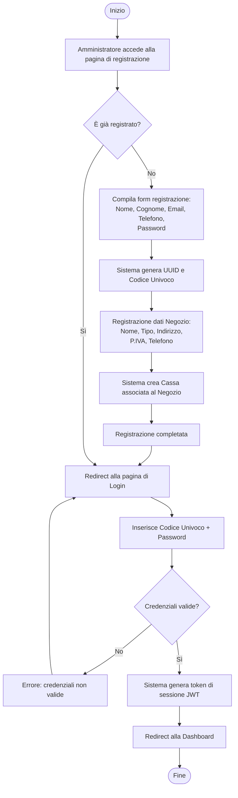
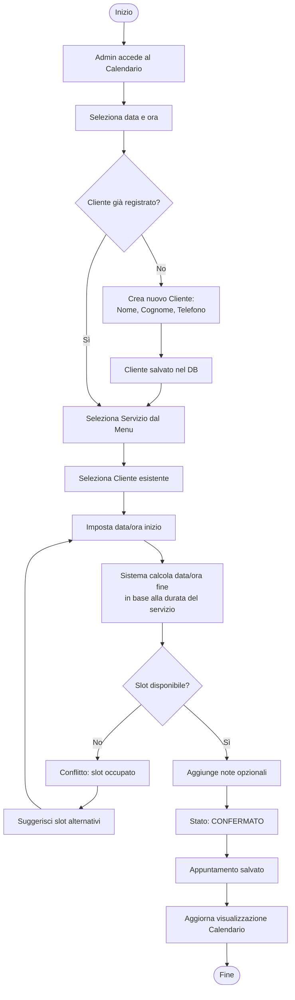
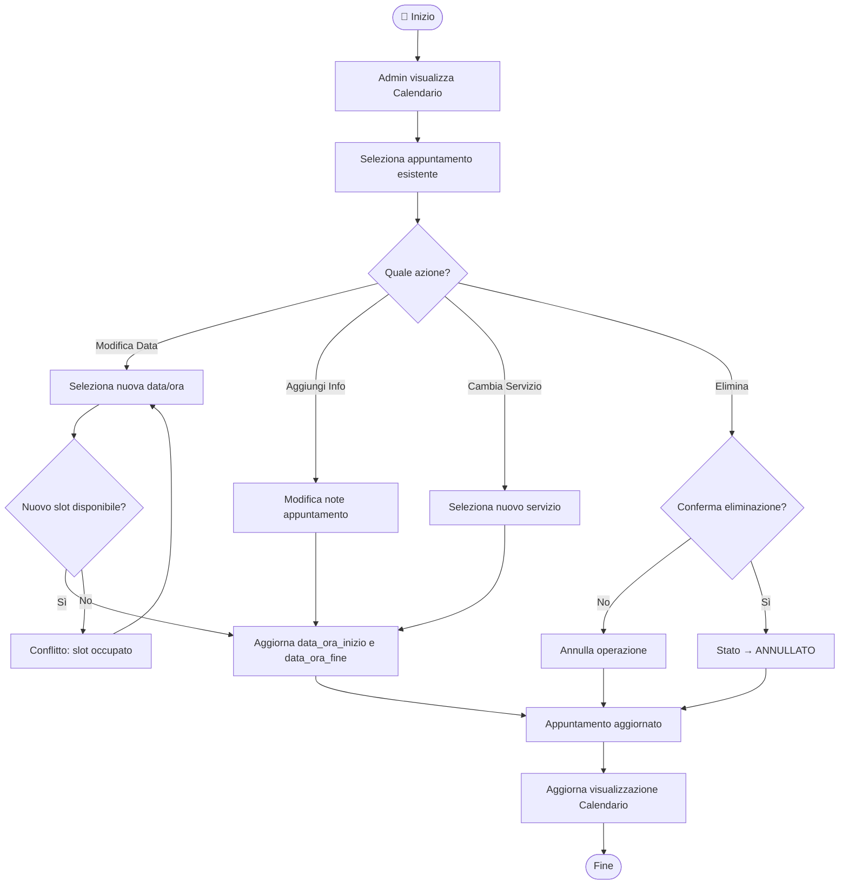
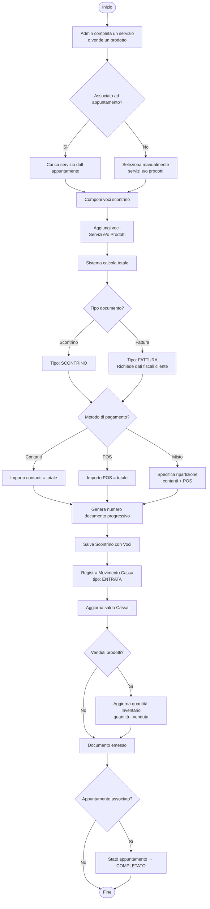
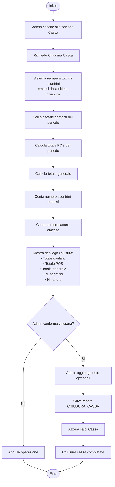
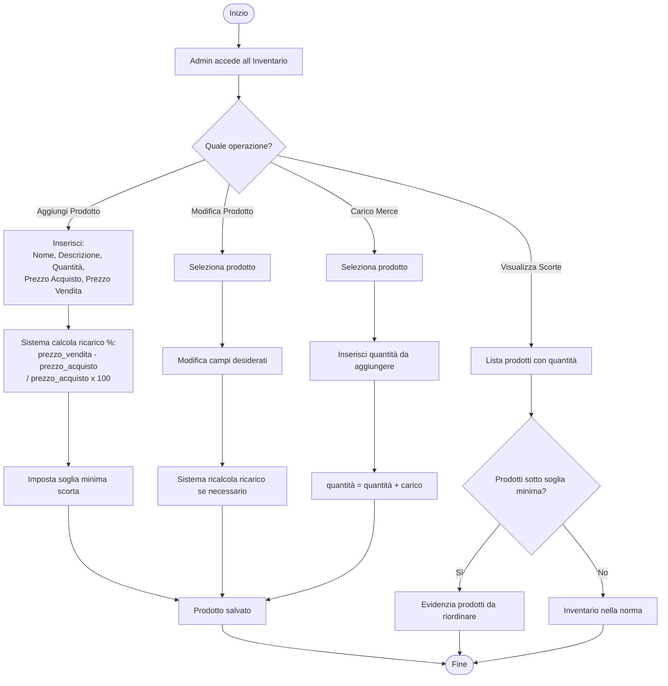
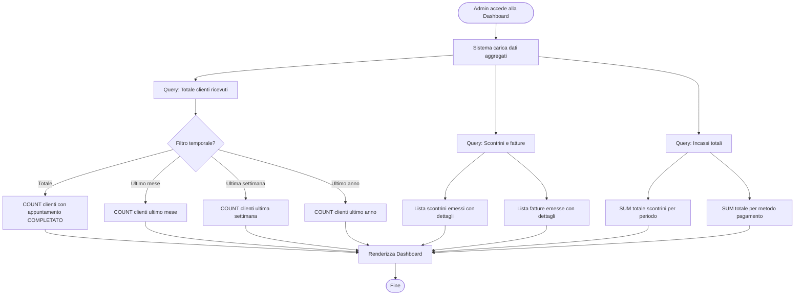
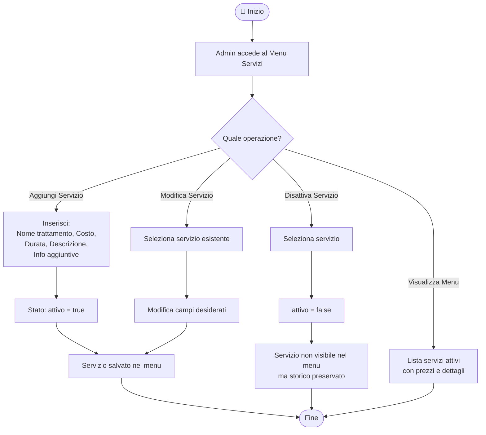

# 🔄 Diagrammi di Flusso — ReserveME

## 1. Registrazione e Login Amministratore

---

## 2. Gestione Appuntamenti

### 2.1 Creazione Appuntamento

### 2.2 Modifica / Eliminazione Appuntamento

---

## 3. Emissione Scontrino / Fattura

---

## 4. Chiusura Cassa

---

## 5. Gestione Inventario

---

## 6. Dashboard — Flusso Dati

---

## 7. Gestione Menu Servizi

