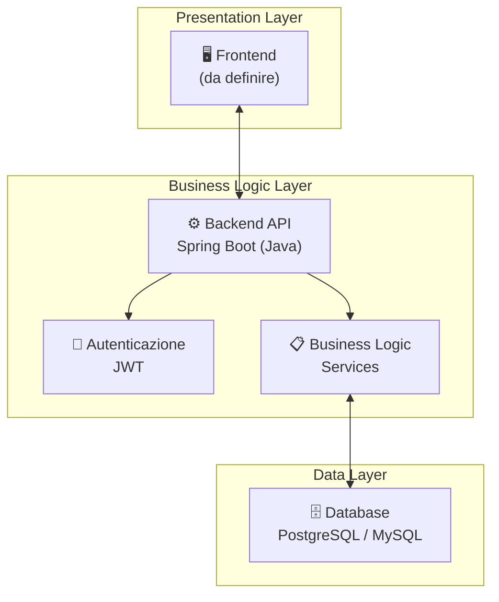
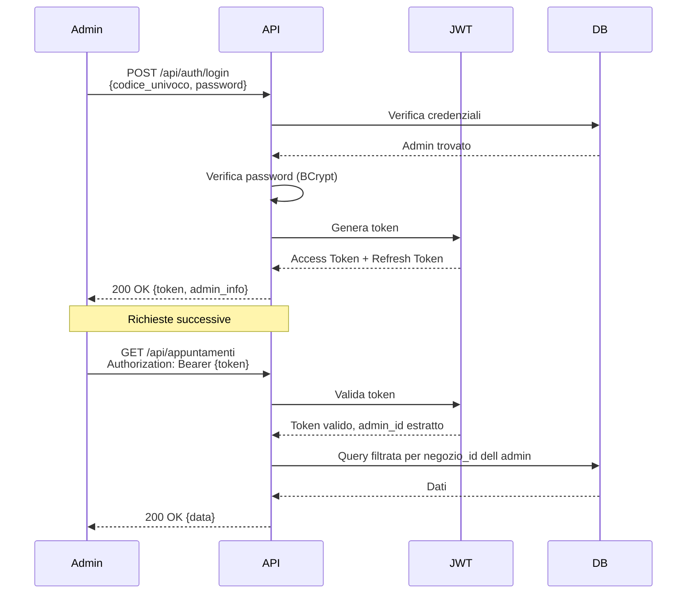

# 📄 Documento di Architettura — ReserveME

## 1. Panoramica del Progetto

### 1.1 Descrizione

**ReserveME** è un gestionale di prenotazioni e appuntamenti progettato per **centri estetici, barberie, parrucchieri e centri massaggi**. Il sistema consente agli amministratori di gestire in modo completo la propria attività attraverso un pannello di controllo unificato.

### 1.2 Obiettivi

| Obiettivo | Descrizione |
|---|---|
| Gestione Appuntamenti | Calendario con prenotazioni, modifica, cancellazione |
| Gestione Clienti | Anagrafica clienti con storico appuntamenti |
| Menu Servizi | Catalogo trattamenti con prezzi e dettagli |
| Gestione Cassa | Emissione scontrini/fatture, pagamenti contanti e POS |
| Chiusura Cassa | Report giornaliero con totali per metodo di pagamento |
| Inventario | Gestione scorte prodotti con ricarichi e soglie minime |
| Dashboard | Statistiche e KPI su clienti, incassi e documenti |

### 1.3 Tipologia

Progetto **didattico** — non richiede deployment in produzione. L'applicativo funzionerà in ambiente locale.

---

## 2. Architettura del Sistema

### 2.1 Pattern Architetturale

Il sistema adotta un'architettura **monolitica a 3 livelli (3-tier)**, ideale per un progetto didattico:



### 2.2 Stack Tecnologico (Backend)

| Componente | Tecnologia | Motivazione |
|---|---|---|
| **Linguaggio** | Java 17+ | Standard didattico, robusto e tipizzato |
| **Framework** | Spring Boot 3.x | Ecosistema maturo, ampia documentazione |
| **ORM** | Spring Data JPA / Hibernate | Mapping oggetti-relazionale automatico |
| **Autenticazione** | Spring Security + JWT | Stateless, scalabile |
| **Database** | PostgreSQL (consigliato) o MySQL | Relazionale, supporto UUID nativo |
| **Build Tool** | Maven o Gradle | Gestione dipendenze |
| **Documentazione API** | Swagger / OpenAPI 3.0 | Documentazione automatica endpoint |

> [!NOTE]
> Lo stack frontend verrà definito nella seconda fase del progetto.

---

## 3. Struttura del Progetto

```
ReserveME/
├── docs/
│   ├── diagramma_er.md
│   ├── diagramma_flusso.md
│   └── document.md
│
└── backend/
    └── reserveme/
        ├── src/
        │   ├── main/
        │   │   ├── java/com/reserveme/
        │   │   │   ├── ReserveMeApplication.java
        │   │   │   │
        │   │   │   ├── config/
        │   │   │   │   ├── SecurityConfig.java
        │   │   │   │   ├── JwtConfig.java
        │   │   │   │   └── CorsConfig.java
        │   │   │   │
        │   │   │   ├── model/
        │   │   │   │   ├── Amministratore.java
        │   │   │   │   ├── Negozio.java
        │   │   │   │   ├── Servizio.java
        │   │   │   │   ├── Cliente.java
        │   │   │   │   ├── Appuntamento.java
        │   │   │   │   ├── Prodotto.java
        │   │   │   │   ├── Scontrino.java
        │   │   │   │   ├── VoceScontrino.java
        │   │   │   │   ├── Cassa.java
        │   │   │   │   ├── ChiusuraCassa.java
        │   │   │   │   ├── MovimentoCassa.java
        │   │   │   │   └── enums/
        │   │   │   │       ├── TipoNegozio.java
        │   │   │   │       ├── StatoAppuntamento.java
        │   │   │   │       ├── MetodoPagamento.java
        │   │   │   │       ├── TipoDocumento.java
        │   │   │   │       ├── StatoDocumento.java
        │   │   │   │       └── TipoMovimento.java
        │   │   │   │
        │   │   │   ├── repository/
        │   │   │   │   ├── AmministratoreRepository.java
        │   │   │   │   ├── NegozioRepository.java
        │   │   │   │   ├── ServizioRepository.java
        │   │   │   │   ├── ClienteRepository.java
        │   │   │   │   ├── AppuntamentoRepository.java
        │   │   │   │   ├── ProdottoRepository.java
        │   │   │   │   ├── ScontrinoRepository.java
        │   │   │   │   ├── VoceScontrinoRepository.java
        │   │   │   │   ├── CassaRepository.java
        │   │   │   │   ├── ChiusuraCassaRepository.java
        │   │   │   │   └── MovimentoCassaRepository.java
        │   │   │   │
        │   │   │   ├── service/
        │   │   │   │   ├── AuthService.java
        │   │   │   │   ├── AmministratoreService.java
        │   │   │   │   ├── NegozioService.java
        │   │   │   │   ├── ServizioService.java
        │   │   │   │   ├── ClienteService.java
        │   │   │   │   ├── AppuntamentoService.java
        │   │   │   │   ├── ProdottoService.java
        │   │   │   │   ├── ScontrinoService.java
        │   │   │   │   ├── CassaService.java
        │   │   │   │   └── DashboardService.java
        │   │   │   │
        │   │   │   ├── controller/
        │   │   │   │   ├── AuthController.java
        │   │   │   │   ├── NegozioController.java
        │   │   │   │   ├── ServizioController.java
        │   │   │   │   ├── ClienteController.java
        │   │   │   │   ├── AppuntamentoController.java
        │   │   │   │   ├── ProdottoController.java
        │   │   │   │   ├── ScontrinoController.java
        │   │   │   │   ├── CassaController.java
        │   │   │   │   └── DashboardController.java
        │   │   │   │
        │   │   │   ├── dto/
        │   │   │   │   ├── request/
        │   │   │   │   │   ├── LoginRequest.java
        │   │   │   │   │   ├── RegistrazioneRequest.java
        │   │   │   │   │   ├── AppuntamentoRequest.java
        │   │   │   │   │   ├── ServizioRequest.java
        │   │   │   │   │   ├── ClienteRequest.java
        │   │   │   │   │   ├── ProdottoRequest.java
        │   │   │   │   │   ├── ScontrinoRequest.java
        │   │   │   │   │   └── ChiusuraCassaRequest.java
        │   │   │   │   │
        │   │   │   │   └── response/
        │   │   │   │       ├── LoginResponse.java
        │   │   │   │       ├── DashboardResponse.java
        │   │   │   │       ├── AppuntamentoResponse.java
        │   │   │   │       ├── ScontrinoResponse.java
        │   │   │   │       ├── IncassiResponse.java
        │   │   │   │       └── InventarioResponse.java
        │   │   │   │
        │   │   │   ├── exception/
        │   │   │   │   ├── GlobalExceptionHandler.java
        │   │   │   │   ├── ResourceNotFoundException.java
        │   │   │   │   ├── SlotNonDisponibileException.java
        │   │   │   │   └── UnauthorizedException.java
        │   │   │   │
        │   │   │   └── util/
        │   │   │       ├── JwtUtil.java
        │   │   │       └── RicaricoCalculator.java
        │   │   │
        │   │   └── resources/
        │   │       ├── application.properties
        │   │       └── data.sql (dati di test opzionali)
        │   │
        │   └── test/
        │       └── java/com/reserveme/
        │           ├── service/
        │           └── controller/
        │
        └── pom.xml (o build.gradle)
```

---

## 4. Modello Dati — Dettaglio Entità

### 4.1 Amministratore

L'entità centrale del sistema. Ogni amministratore possiede esattamente un negozio.

| Campo | Tipo | Vincoli | Descrizione |
|---|---|---|---|
| `id` | UUID | PK, auto-generato | Identificativo univoco |
| `codice_univoco` | VARCHAR(50) | UNIQUE, NOT NULL | Codice di accesso |
| `password` | VARCHAR(255) | NOT NULL | Password hashata (BCrypt) |
| `nome` | VARCHAR(100) | NOT NULL | Nome |
| `cognome` | VARCHAR(100) | NOT NULL | Cognome |
| `email` | VARCHAR(150) | UNIQUE, NOT NULL | Email |
| `telefono` | VARCHAR(20) | | Telefono |
| `created_at` | TIMESTAMP | NOT NULL, DEFAULT NOW | Data creazione |
| `updated_at` | TIMESTAMP | NOT NULL, DEFAULT NOW | Data aggiornamento |

---

### 4.2 Negozio

Rappresenta l'attività commerciale dell'amministratore.

| Campo | Tipo | Vincoli | Descrizione |
|---|---|---|---|
| `id` | SERIAL | PK | Identificativo negozio |
| `admin_id` | UUID | FK → Amministratore, UNIQUE | Proprietario |
| `nome` | VARCHAR(200) | NOT NULL | Nome attività |
| `tipo` | ENUM | NOT NULL | `CENTRO_ESTETICO`, `BARBERIA`, `PARRUCCHIERE`, `CENTRO_MASSAGGI` |
| `indirizzo` | VARCHAR(300) | | Indirizzo |
| `citta` | VARCHAR(100) | | Città |
| `cap` | VARCHAR(10) | | CAP |
| `telefono` | VARCHAR(20) | | Telefono negozio |
| `partita_iva` | VARCHAR(20) | UNIQUE | Partita IVA |
| `created_at` | TIMESTAMP | NOT NULL | Data creazione |
| `updated_at` | TIMESTAMP | NOT NULL | Data aggiornamento |

---

### 4.3 Servizio (Menu)

I trattamenti offerti dal negozio.

| Campo | Tipo | Vincoli | Descrizione |
|---|---|---|---|
| `id` | SERIAL | PK | Identificativo servizio |
| `negozio_id` | INT | FK → Negozio, NOT NULL | Negozio di appartenenza |
| `nome_trattamento` | VARCHAR(200) | NOT NULL | Nome del trattamento |
| `costo` | DECIMAL(10,2) | NOT NULL | Prezzo |
| `durata_minuti` | INT | | Durata stimata |
| `descrizione` | TEXT | | Descrizione |
| `info_aggiuntive` | TEXT | | Info extra |
| `attivo` | BOOLEAN | DEFAULT true | Visibilità nel menu |
| `created_at` | TIMESTAMP | NOT NULL | Data creazione |
| `updated_at` | TIMESTAMP | NOT NULL | Data aggiornamento |

---

### 4.4 Cliente

Anagrafica dei clienti del negozio.

| Campo | Tipo | Vincoli | Descrizione |
|---|---|---|---|
| `id` | SERIAL | PK | Identificativo cliente |
| `negozio_id` | INT | FK → Negozio, NOT NULL | Negozio di appartenenza |
| `nome` | VARCHAR(100) | NOT NULL | Nome |
| `cognome` | VARCHAR(100) | NOT NULL | Cognome |
| `telefono` | VARCHAR(20) | NOT NULL | Telefono |
| `email` | VARCHAR(150) | | Email |
| `note` | TEXT | | Note libere |
| `created_at` | TIMESTAMP | NOT NULL | Data creazione |
| `updated_at` | TIMESTAMP | NOT NULL | Data aggiornamento |

---

### 4.5 Appuntamento

Prenotazione di un cliente per un servizio specifico.

| Campo | Tipo | Vincoli | Descrizione |
|---|---|---|---|
| `id` | SERIAL | PK | Identificativo appuntamento |
| `negozio_id` | INT | FK → Negozio, NOT NULL | Negozio |
| `cliente_id` | INT | FK → Cliente, NOT NULL | Cliente che prenota |
| `servizio_id` | INT | FK → Servizio, NOT NULL | Servizio richiesto |
| `data_ora_inizio` | TIMESTAMP | NOT NULL | Inizio appuntamento |
| `data_ora_fine` | TIMESTAMP | NOT NULL | Fine appuntamento |
| `stato` | ENUM | NOT NULL, DEFAULT 'CONFERMATO' | `CONFERMATO`, `IN_ATTESA`, `COMPLETATO`, `ANNULLATO` |
| `note` | TEXT | | Note aggiuntive |
| `created_at` | TIMESTAMP | NOT NULL | Data creazione |
| `updated_at` | TIMESTAMP | NOT NULL | Data aggiornamento |

> [!IMPORTANT]
> **Vincolo di business**: Non possono esistere due appuntamenti sovrapposti nello stesso negozio per lo stesso intervallo temporale (esclusi quelli con stato `ANNULLATO`).

---

### 4.6 Prodotto (Inventario)

Prodotti fisici venduti o utilizzati dal negozio.

| Campo | Tipo | Vincoli | Descrizione |
|---|---|---|---|
| `id` | SERIAL | PK | Identificativo prodotto |
| `negozio_id` | INT | FK → Negozio, NOT NULL | Negozio |
| `nome` | VARCHAR(200) | NOT NULL | Nome prodotto |
| `descrizione` | TEXT | | Descrizione |
| `quantita` | INT | NOT NULL, DEFAULT 0 | Quantità in magazzino |
| `prezzo_acquisto` | DECIMAL(10,2) | NOT NULL | Prezzo di acquisto |
| `prezzo_vendita` | DECIMAL(10,2) | NOT NULL | Prezzo di vendita |
| `ricarico_percentuale` | DECIMAL(5,2) | | Ricarico % calcolato |
| `soglia_minima` | INT | DEFAULT 0 | Soglia scorta minima |
| `created_at` | TIMESTAMP | NOT NULL | Data creazione |
| `updated_at` | TIMESTAMP | NOT NULL | Data aggiornamento |

> [!TIP]
> **Formula ricarico**: `ricarico_percentuale = ((prezzo_vendita - prezzo_acquisto) / prezzo_acquisto) * 100`

---

### 4.7 Scontrino

Documento fiscale (scontrino o fattura) emesso dal negozio.

| Campo | Tipo | Vincoli | Descrizione |
|---|---|---|---|
| `id` | SERIAL | PK | Identificativo |
| `negozio_id` | INT | FK → Negozio, NOT NULL | Negozio emittente |
| `cliente_id` | INT | FK → Cliente, NULL | Cliente associato |
| `appuntamento_id` | INT | FK → Appuntamento, NULL | Appuntamento associato |
| `numero_documento` | VARCHAR(50) | NOT NULL | Numero progressivo |
| `data_emissione` | TIMESTAMP | NOT NULL | Data emissione |
| `totale` | DECIMAL(10,2) | NOT NULL | Totale |
| `metodo_pagamento` | ENUM | NOT NULL | `CONTANTI`, `POS`, `MISTO` |
| `tipo_documento` | ENUM | NOT NULL | `SCONTRINO`, `FATTURA` |
| `stato` | ENUM | NOT NULL, DEFAULT 'EMESSO' | `EMESSO`, `ANNULLATO` |
| `importo_contanti` | DECIMAL(10,2) | DEFAULT 0 | Quota contanti |
| `importo_pos` | DECIMAL(10,2) | DEFAULT 0 | Quota POS |
| `created_at` | TIMESTAMP | NOT NULL | Data creazione |

---

### 4.8 Voce Scontrino

Singola riga di dettaglio all'interno di uno scontrino.

| Campo | Tipo | Vincoli | Descrizione |
|---|---|---|---|
| `id` | SERIAL | PK | Identificativo |
| `scontrino_id` | INT | FK → Scontrino, NOT NULL | Scontrino padre |
| `servizio_id` | INT | FK → Servizio, NULL | Servizio venduto |
| `prodotto_id` | INT | FK → Prodotto, NULL | Prodotto venduto |
| `descrizione` | VARCHAR(300) | NOT NULL | Descrizione voce |
| `quantita` | INT | NOT NULL, DEFAULT 1 | Quantità |
| `prezzo_unitario` | DECIMAL(10,2) | NOT NULL | Prezzo unitario |
| `subtotale` | DECIMAL(10,2) | NOT NULL | Subtotale riga |

> [!NOTE]
> Ogni voce ha **almeno uno** tra `servizio_id` e `prodotto_id` valorizzato (vincolo CHECK).

---

### 4.9 Cassa

Cassa registratore del negozio.

| Campo | Tipo | Vincoli | Descrizione |
|---|---|---|---|
| `id` | SERIAL | PK | Identificativo |
| `negozio_id` | INT | FK → Negozio, UNIQUE | Negozio (1:1) |
| `saldo_contanti` | DECIMAL(10,2) | DEFAULT 0 | Saldo contanti |
| `saldo_pos` | DECIMAL(10,2) | DEFAULT 0 | Saldo POS |
| `ultimo_aggiornamento` | TIMESTAMP | | Ultimo update |

---

### 4.10 Chiusura Cassa

Record storico di ogni chiusura cassa effettuata.

| Campo | Tipo | Vincoli | Descrizione |
|---|---|---|---|
| `id` | SERIAL | PK | Identificativo |
| `cassa_id` | INT | FK → Cassa, NOT NULL | Cassa |
| `data_chiusura` | TIMESTAMP | NOT NULL | Data/ora chiusura |
| `totale_contanti` | DECIMAL(10,2) | NOT NULL | Totale contanti |
| `totale_pos` | DECIMAL(10,2) | NOT NULL | Totale POS |
| `totale_generale` | DECIMAL(10,2) | NOT NULL | Totale generale |
| `num_scontrini` | INT | DEFAULT 0 | N. scontrini |
| `num_fatture` | INT | DEFAULT 0 | N. fatture |
| `note` | TEXT | | Note |
| `created_at` | TIMESTAMP | NOT NULL | Data creazione |

---

### 4.11 Movimento Cassa

Traccia ogni movimento di denaro nella cassa.

| Campo | Tipo | Vincoli | Descrizione |
|---|---|---|---|
| `id` | SERIAL | PK | Identificativo |
| `cassa_id` | INT | FK → Cassa, NOT NULL | Cassa |
| `tipo` | ENUM | NOT NULL | `ENTRATA`, `USCITA` |
| `metodo` | ENUM | NOT NULL | `CONTANTI`, `POS` |
| `importo` | DECIMAL(10,2) | NOT NULL | Importo |
| `descrizione` | VARCHAR(300) | | Descrizione |
| `scontrino_id` | INT | FK → Scontrino, NULL | Scontrino collegato |
| `data` | TIMESTAMP | NOT NULL | Data movimento |

---

## 5. API REST — Endpoint

### 5.1 Autenticazione

| Metodo | Endpoint | Descrizione |
|---|---|---|
| `POST` | `/api/auth/register` | Registrazione admin + negozio |
| `POST` | `/api/auth/login` | Login con codice univoco + password |
| `POST` | `/api/auth/refresh` | Refresh token JWT |

### 5.2 Negozio

| Metodo | Endpoint | Descrizione |
|---|---|---|
| `GET` | `/api/negozio` | Dati del negozio dell'admin loggato |
| `PUT` | `/api/negozio` | Aggiorna dati negozio |

### 5.3 Servizi (Menu)

| Metodo | Endpoint | Descrizione |
|---|---|---|
| `GET` | `/api/servizi` | Lista servizi attivi |
| `GET` | `/api/servizi/{id}` | Dettaglio servizio |
| `POST` | `/api/servizi` | Crea nuovo servizio |
| `PUT` | `/api/servizi/{id}` | Modifica servizio |
| `DELETE` | `/api/servizi/{id}` | Disattiva servizio (soft delete) |

### 5.4 Clienti

| Metodo | Endpoint | Descrizione |
|---|---|---|
| `GET` | `/api/clienti` | Lista clienti (con paginazione) |
| `GET` | `/api/clienti/{id}` | Dettaglio cliente |
| `POST` | `/api/clienti` | Crea nuovo cliente |
| `PUT` | `/api/clienti/{id}` | Modifica cliente |
| `DELETE` | `/api/clienti/{id}` | Elimina cliente |
| `GET` | `/api/clienti/{id}/appuntamenti` | Storico appuntamenti del cliente |

### 5.5 Appuntamenti

| Metodo | Endpoint | Descrizione |
|---|---|---|
| `GET` | `/api/appuntamenti` | Lista appuntamenti (con filtri data) |
| `GET` | `/api/appuntamenti/{id}` | Dettaglio appuntamento |
| `POST` | `/api/appuntamenti` | Crea appuntamento |
| `PUT` | `/api/appuntamenti/{id}` | Modifica appuntamento |
| `PATCH` | `/api/appuntamenti/{id}/stato` | Cambia stato appuntamento |
| `DELETE` | `/api/appuntamenti/{id}` | Annulla appuntamento |
| `GET` | `/api/appuntamenti/calendario` | Vista calendario (range date) |

### 5.6 Inventario (Prodotti)

| Metodo | Endpoint | Descrizione |
|---|---|---|
| `GET` | `/api/prodotti` | Lista prodotti |
| `GET` | `/api/prodotti/{id}` | Dettaglio prodotto |
| `POST` | `/api/prodotti` | Aggiungi prodotto |
| `PUT` | `/api/prodotti/{id}` | Modifica prodotto |
| `PATCH` | `/api/prodotti/{id}/carico` | Carico merce (aggiorna quantità) |
| `DELETE` | `/api/prodotti/{id}` | Elimina prodotto |
| `GET` | `/api/prodotti/sotto-soglia` | Prodotti sotto scorta minima |

### 5.7 Scontrini / Fatture

| Metodo | Endpoint | Descrizione |
|---|---|---|
| `GET` | `/api/scontrini` | Lista documenti (con filtri) |
| `GET` | `/api/scontrini/{id}` | Dettaglio con voci |
| `POST` | `/api/scontrini` | Emetti scontrino/fattura |
| `PATCH` | `/api/scontrini/{id}/annulla` | Annulla documento |

### 5.8 Cassa

| Metodo | Endpoint | Descrizione |
|---|---|---|
| `GET` | `/api/cassa` | Stato cassa attuale |
| `GET` | `/api/cassa/movimenti` | Lista movimenti |
| `POST` | `/api/cassa/chiusura` | Effettua chiusura cassa |
| `GET` | `/api/cassa/chiusure` | Storico chiusure |
| `GET` | `/api/cassa/chiusure/{id}` | Dettaglio chiusura |

### 5.9 Dashboard

| Metodo | Endpoint | Descrizione |
|---|---|---|
| `GET` | `/api/dashboard/clienti` | Statistiche clienti (con filtri temporali) |
| `GET` | `/api/dashboard/incassi` | Statistiche incassi (con filtri temporali) |
| `GET` | `/api/dashboard/documenti` | Riepilogo scontrini/fatture |
| `GET` | `/api/dashboard/riepilogo` | Dashboard completa |

---

## 6. Sicurezza

### 6.1 Autenticazione



### 6.2 Regole di Sicurezza

| Regola | Implementazione |
|---|---|
| Password hashate | BCrypt con salt |
| Token JWT | Scadenza 24h (access), 7gg (refresh) |
| Isolamento dati | Ogni query filtrata per `negozio_id` dell'admin loggato |
| Validazione input | Bean Validation (`@Valid`, `@NotBlank`, etc.) |
| Gestione errori | `GlobalExceptionHandler` con risposte standardizzate |

---

## 7. Regole di Business

### 7.1 Appuntamenti
- Non è possibile creare appuntamenti sovrapposti (stesso negozio, stesso intervallo temporale)
- La `data_ora_fine` viene calcolata automaticamente: `data_ora_inizio + durata_minuti del servizio`
- Un appuntamento `ANNULLATO` libera lo slot
- Un appuntamento `COMPLETATO` può generare uno scontrino

### 7.2 Scontrini / Fatture
- Il numero documento è progressivo per negozio
- L'emissione di uno scontrino genera automaticamente un `MOVIMENTO_CASSA` di tipo `ENTRATA`
- Se lo scontrino include prodotti, le quantità dell'inventario vengono decrementate
- Un documento `ANNULLATO` genera un `MOVIMENTO_CASSA` di tipo `USCITA` (storno)

### 7.3 Cassa
- Ogni negozio ha esattamente **una** cassa
- La cassa viene creata automaticamente alla registrazione del negozio
- La chiusura cassa calcola i totali da tutti gli scontrini emessi dall'ultima chiusura
- Dopo la chiusura, i saldi vengono azzerati

### 7.4 Inventario
- Il ricarico viene ricalcolato automaticamente quando si modificano prezzo_acquisto o prezzo_vendita
- I prodotti sotto soglia minima vengono segnalati nella dashboard

### 7.5 Multi-tenancy
- **Ogni dato è isolato per negozio**: tutte le query devono filtrare per il `negozio_id` dell'amministratore autenticato
- Un admin non può accedere ai dati di un altro admin

---

## 8. Risposte API — Formato Standard

### Risposta di Successo
```json
{
    "status": 200,
    "message": "Operazione completata con successo",
    "data": { ... },
    "timestamp": "2026-06-20T14:00:00Z"
}
```

### Risposta di Errore
```json
{
    "status": 400,
    "error": "Bad Request",
    "message": "Il campo 'nome_trattamento' è obbligatorio",
    "path": "/api/servizi",
    "timestamp": "2026-06-20T14:00:00Z"
}
```

### Risposta Paginata
```json
{
    "status": 200,
    "data": {
        "content": [ ... ],
        "page": 0,
        "size": 20,
        "totalElements": 150,
        "totalPages": 8
    },
    "timestamp": "2026-06-20T14:00:00Z"
}
```

---

## 9. Configurazione Database

### application.properties (esempio PostgreSQL)

```properties
# Database
spring.datasource.url=jdbc:postgresql://localhost:5432/reserveme
spring.datasource.username=reserveme_user
spring.datasource.password=reserveme_pass
spring.datasource.driver-class-name=org.postgresql.Driver

# JPA / Hibernate
spring.jpa.hibernate.ddl-auto=update
spring.jpa.show-sql=true
spring.jpa.properties.hibernate.dialect=org.hibernate.dialect.PostgreSQLDialect
spring.jpa.properties.hibernate.format_sql=true

# JWT
jwt.secret=your-secret-key-here
jwt.expiration=86400000
jwt.refresh-expiration=604800000

# Server
server.port=8080
```

---

## 10. Prossimi Passi

| Fase | Attività | Stato |
|---|---|---|
| **Fase 1** | Progettazione (ER, Flussi, Documento) | ✅ Completata |
| **Fase 2** | Setup progetto Spring Boot + Database | ⬜ Da iniziare |
| **Fase 3** | Implementazione Model + Repository | ⬜ Da iniziare |
| **Fase 4** | Implementazione Service + Business Logic | ⬜ Da iniziare |
| **Fase 5** | Implementazione Controller + API REST | ⬜ Da iniziare |
| **Fase 6** | Autenticazione JWT + Security | ⬜ Da iniziare |
| **Fase 7** | Testing | ⬜ Da iniziare |
| **Fase 8** | Frontend (da definire) | ⬜ Da iniziare |
